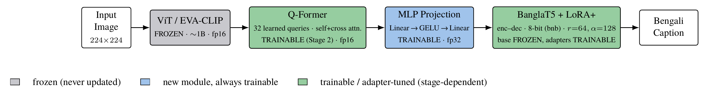
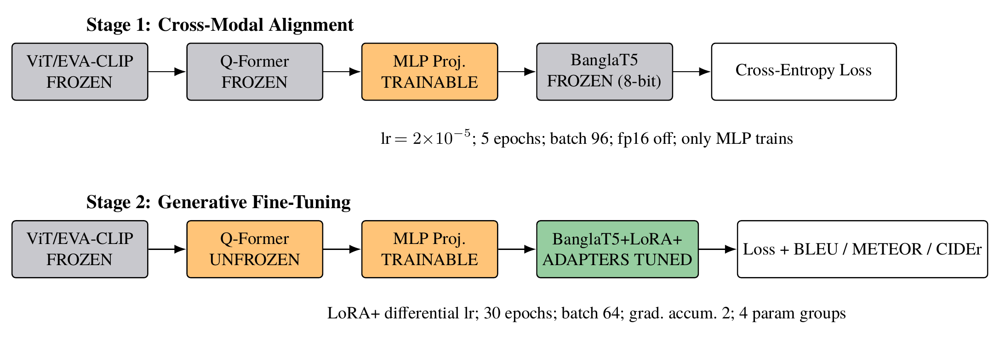
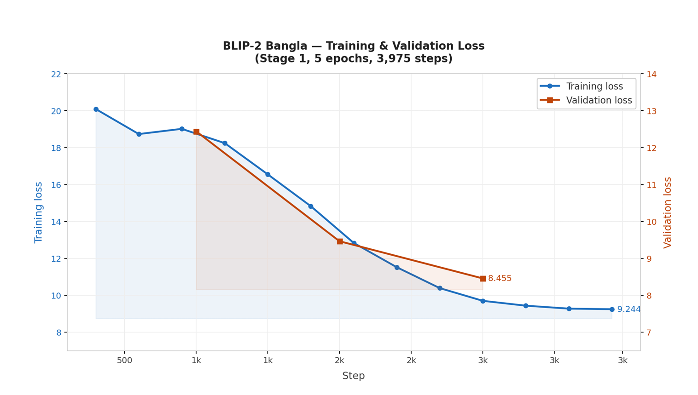
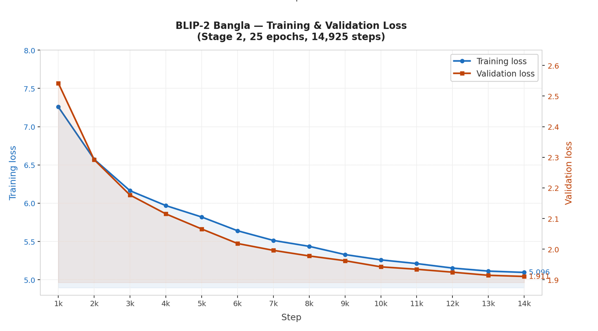
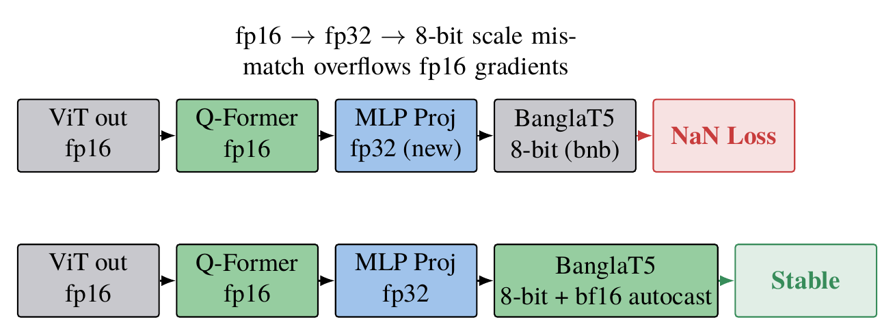

# BanglaBLIP

> Bengali Image Captioning with Vision-Language Alignment
> Nayeem Uz Zaman · Suprio Paul · Himel Sutradhar · Ibtidia Bin Ahmed

This repository contains **BBLIP**, an adaptation of BLIP-2 for native Bengali image captioning. Instead of translating English captions or training a captioning network from scratch, BBLIP freezes a pretrained vision encoder and a pretrained Bengali language model, and learns only a lightweight bridge between them — making it trainable end to end on a single Kaggle T4 GPU.

Trained checkpoint: **[`Suprio85/BanglaBlip-30k`](https://huggingface.co/Suprio85/BanglaBlip-30k)** on Hugging Face.

## Why this is hard

Vision-language models like GPT-4V and CLIP perform poorly on Bengali — the 7th most spoken language globally, with over 230 million speakers — because:
- No native Bengali multimodal captioning model exists at scale.
- Existing pipelines rely on English-to-Bengali translation, which loses cultural context.
- Bengali image-caption datasets are small, and full fine-tuning of a billion-parameter VLM is out of reach on consumer/free-tier GPUs.

## Architecture



A frozen ViT/EVA-CLIP encoder produces raw visual features. A **Q-Former** with 32 learnable query tokens compresses these into a short sequence of language-aligned visual tokens via self- and cross-attention — this is the key bridge that a direct vision-to-decoder connection is missing. A **Linear-GELU-Linear projection head** maps the Q-Former's output into BanglaT5's embedding space, and **BanglaT5** (`csebuetnlp/banglat5`), loaded in 8-bit and adapted with LoRA+, decodes the final Bengali caption.

Only the Q-Former, projection head, and LoRA+ adapters are ever updated — the ~1B-parameter vision encoder and BanglaT5's base weights are frozen throughout.

## Two-stage training



Training jointly from a random initialization risks catastrophic interference, since an untrained projection head would inject noise into the decoder before the Q-Former has learned anything useful. We split training into two stages instead:

- **Stage 1 — cross-modal alignment.** Only the MLP projection head is trainable. Vision encoder, Q-Former, and BanglaT5 stay frozen. `lr=2e-5`, 5 epochs, batch 96, fp16 disabled.
- **Stage 2 — generative fine-tuning.** The Q-Former is fully unfrozen, the projection head keeps training, and LoRA+ adapters are injected into BanglaT5. All trained jointly for 30 epochs (batch 64, grad accumulation 2) with differential learning rates across 4 parameter groups — LoRA+'s $B$ matrices train at 16× the rate of the $A$ matrices.

### Training curves

| Stage 1 (alignment) | Stage 2 (generative fine-tuning) |
|---|---|
|  |  |

Stage 1 falls steeply as the projection head learns a coarse mapping, then plateaus once the frozen Q-Former stops providing new alignable signal (val loss 8.46). Stage 2 starts from that aligned checkpoint and decreases smoothly to a val loss of 1.91 — consistent with real generative learning rather than re-alignment.

## Mixed-precision strategy



Combining fp16 encoder activations, a freshly initialized fp32 projection layer, and an 8-bit-quantized decoder in a single forward/backward pass caused NaN losses during Stage 2 — the scale mismatch across three numeric formats overflowed fp16 gradients. The fix: keep Stage 1 entirely in fp32, and switch BanglaT5 to **bfloat16 autocast** in Stage 2. bfloat16 keeps float32's 8-bit exponent range even though its mantissa is coarser, so it doesn't overflow at the same boundary.

## Engineering challenges

| Problem | Solution |
|---|---|
| **GPU memory** — loading ViT + Q-Former + BanglaT5 together exceeds T4 VRAM at checkpoint time | Override `state_dict()` to drop the unused BLIP-2 English decoder, persist only the weights that actually change (LoRA, MLP, Q-Former), and skip the frozen ViT entirely (~2GB saved per checkpoint) |
| **Bengali tokenizer corruption** — HF's fast tokenizer silently fragments conjunct characters | Load with `use_fast=False`, apply NFC normalization, and run `csebuetnlp/normalizer` to strip ZWJ/ZWNJ/BOM artifacts before tokenization |

## Datasets

Three Bengali captioning corpora, merged for training and evaluated independently:

| Dataset | Size | Notes |
|---|---|---|
| Flickr8k (Bengali) | 8,000 images, 5 captions/image | Bengali captions for the original Flickr8k images, via Kaggle |
| BanglaLekha Captions | 1,333 images, 6,665 captions | DSLR + smartphone captured, varied lighting; via Mendeley |
| BNature (Bengali) | Nature/outdoor scenes, 5 captions/image | Culturally specific outdoor content, via Kaggle |

## Results

Best configuration per dataset (LoRA rank `r` / Stage-2 epochs / length penalty):

| Dataset | Config | BLEU-1 | BLEU-4 | METEOR | CIDEr |
|---|---|---|---|---|---|
| BanglaLekha | r=64 / 16 ep / LP 1.5 | 0.557 | 0.181 | 0.469 | 1.219 |
| Flickr8k (BN) | r=64 / 10 ep / LP 0.4 | 0.666 | 0.221 | 0.399 | 0.592 |
| BNature | r=64 / 10 ep | 0.560 | 0.191 | 0.437 | 0.559 |

LoRA rank 64 is the consistent sweet spot across all three datasets — rank 32 under-fits, rank 128 shows diminishing returns. Generation length penalty above 1.0 helps on BanglaLekha and BNature, whose references run longer and more variable than Flickr8k's.

## The journey

The final design followed three earlier attempts:

1. **ViT → BanglaT5 (direct)** — *Failed.* No bridging module; loss got stuck, modality gap too large to close with a single projection.
2. **Alternative bridges** — *Discarded.* DoRA (no gain, much slower), vision-side LoRA (unstable), gated projection (poor), NEFTune (worse). All dropped.
3. **Pivot to BLIP-2** — *Breakthrough.* The Q-Former as an explicit bridge resolved the alignment failure — loss finally dropped and kept dropping.
4. **BBLIP (final)** — *Success.* Linear → MLP (Linear-GELU-Linear), LoRA → LoRA+, plus the Bengali normalizer — stable convergence in both stages.

## Notebooks

- `notebooks/forkofbblip-banglaleka.ipynb` — training/evaluation on BanglaLekha Captions
- `notebooks/bblip-bnature.ipynb` — training/evaluation on BNature
- `notebooks/bblip-merged-30k.ipynb` — training on the merged 30K-sample dataset (checkpoint released as `BanglaBlip-30k`)
- `notebooks/bblip-inference.ipynb` — inference pipeline: adapter merge, caption generation
- `notebooks/infer_hosting_with-ngrok.ipynb` — hosting the model as an API via Colab + ngrok

## Citation

```bibtex
@misc{banglablip2026,
  author = {Zaman, Nayeem Uz and Paul, Suprio and Sutradhar, Himel and Ahmed, Ibtidia Bin},
  title  = {BanglaBLIP: Bengali Image Captioning with Vision-Language Alignment},
  year   = {2026},
  note   = {Model checkpoint: \url{https://huggingface.co/Suprio85/BanglaBlip-30k}}
}
```

## Acknowledgements

Built on BLIP-2 (Li et al., ICML 2023), BanglaT5 (`csebuetnlp/banglat5`), and LoRA+ (Hayou et al., ICML 2024). Thanks to the maintainers of the Flickr8k, BanglaLekha, and BNature datasets, and the Hugging Face, PEFT, and bitsandbytes communities.